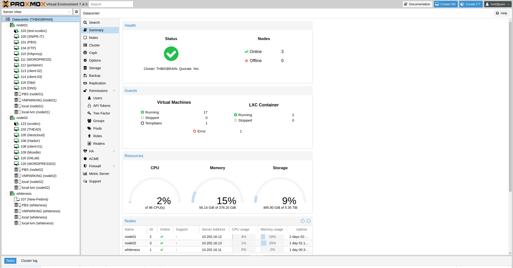
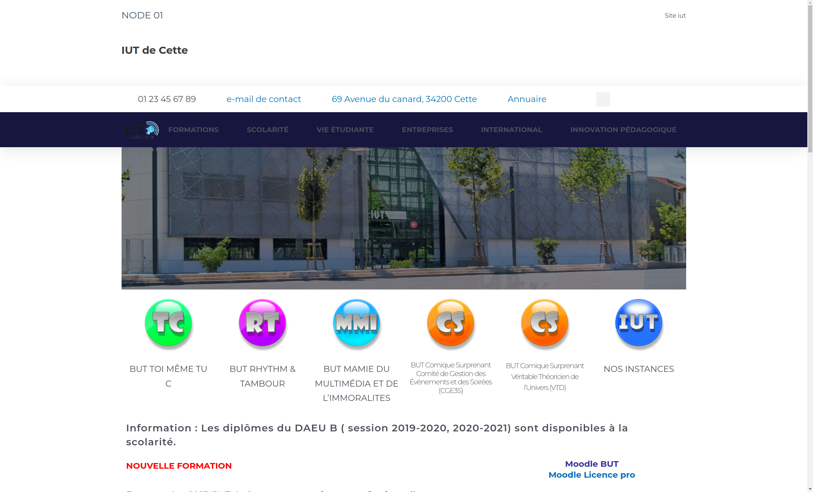

# SAE DevCloud_d01 2023

<link rel="stylesheet" type="text/css" href="style.css">

</br></br></br></br></br></br></br></br></br></br></br>

- Contexte
- Présentation rapide de notre solution
- Notre infrastructure physique
- Nos services mis en place
- Fonctionnement
- Budgétisation
- Gestion de projet
- Conclusion

<div style="page-break-after: always; visibility: hidden"></div>

## Contexte

Nous sommes à l'IUT de Cette, cet IUT vient d'ouvrir et donc tout est à mettre à place. On nous demande d'implémenter tous les services possibles de l'IUT sous forme **containérisée**. Il faut mettre en place de la haute disponibilité pour certains services et si possible avec de l'équilibrage de charge.

Nous de devons mettre en place ces processus :

- Un DNS en haute disponibilité (via IPVS).
  - Un DNS  (bind9). (qui sera dans le cloud)
  - Un DNS (unbound).
- Un DHCP.
- Un serveur FTP.
- Au moins un client Windows connecté à un contrôleur de domaine Samba 3 ou 4.
- Un service Glpi d'inventaire. (Vos matériels y seront référencés)
- Un firewall (pfsense)
- Une solution permettant de gérer les containers de façon centralisé (A l'exclusion d'un orchestrateur de container comme Kubernetes) comme Portainer.

Et les services applicatifs containérisés suivants à destination des usagers:

- Un serveur Gitlab qui vous servira de stockage de vos configurations.
- Un serveur web IUT à base d'un "Content" Management System" comme celui de l'IUT de Béziers. HA proxy assurera l'équilibrage de charge et la haute disponibilité.
  Vous testerez en charge cette solution.
- Un serveur de note Scodoc obligatoirement containérisé.
- Un serveur Nextcloud.
- Un serveur Samba. (Le client Windows l'utilisera).
- Un Kanban de votre choix internalisé ou externalisé.
  
Un stockage partagé NFS permettra de survivre à l'arrêt d'un serveur pour les containers redondés.

<div style="page-break-after: always; visibility: hidden">\pagebreak</div>

## Présentation rapide de notre solution

Pour réaliser l'infrastructure de l'IUT nous avons choisi une solution haute disponibilité base sur un cluster proxmox de trois serveur, un stockage partager NFS qui est présent sur un quatrième serveur cette foie ci sur TrueNAS. Pour protéger cette infrastructure nous avons fait le choix de prendre un firewall physique Stormshield.

### Explication de nos choix

Nous avons choisi un pare-feu physique de la marque Stormshield pour garantir une sécurité et une fiabilité accrues. Bien que nous ayons également installé PFSense et OPNSense auparavant, nous avons décidé de ne pas les conserver en raison de leur complexité et pour éviter les problèmes potentiels liés aux paquets Linux préinstallés.

Pour notre solution haute disponibilité, nous avons opté pour la virtualisation avec Proxmox, une plateforme 100% open-source parfaitement adaptée aux besoins des entreprises. Nous avons préféré cette solution à VMWare en raison des licences et grâce à la fonction de sauvegarde dédupliquée fournie par Proxmox (Proxmox Backup Server).

Pour le stockage NFS, nous avons choisi TrueNAS. TrueNAS permet de transformer n'importe quel PC ou serveur en NAS de manière extrêmement simple et efficace. Il nous permet également de réaliser une déduplication sur les disques partagés, optimisant ainsi l'utilisation de l'espace de stockage disponible. De plus, nous avons pris la décision de crypter le contenu des disques afin de garantir la sécurité de nos données.

<div style="page-break-after: always; visibility: hidden">\pagebreak</div>

## Notre infrastructure physique et logique

### Architecture physique

Notre architecture est basé sur 4 server Dell R6515 qui communique entre eux via un lien 10 Gbps, le réseau est lui assuré par notre firewall SN210W qui dispose d'un lien 1Gbps.

> Du au limitation de la salle, et pour assurer les meilleur performance pour les migrations et la HA les serveur sont donc sur le switch 10 Gbs de la salle et notre réseau interne sur notre switch 1 Gbs.

Voici un schéma représentatif de notre architecture physique :


### Notre architecture logique

Notre architecture logique est donc une simplement constituer de deux réseaux, un pour tout les services mise en place et pour les utilisateur du réseau, et un second pour l'intercommunication des serveurs pour pouvoir profiter du switch 10 Gbs.

Voici un schéma représentatif de notre architecture logique :


Voici les IPs des diferent services :

| Wan          | LAN            | Type          | Login                      | Passwd          | Port | URL                            |
|--------------|----------------|---------------|----------------------------|-----------------|------|--------------------------------|
| 10.202.16.1  |                | Idrac         | root                       | ecq             |      |                                |
| 10.202.16.2  |                | Idrac         | root                       | ecq             |      |                                |
| 10.202.16.3  |                | Idrac         | root                       | ecq             |      |                                |
| 10.202.16.4  |                | Idrac         | root                       | ecq             |      |                                |
|              |                |               |                            |                 |      |                                |
| 10.202.16.10 |                | TrueNas       | root                       | rftjy34         |      | `https://10.202.16.10/`        |
| 10.202.16.11 | 192.168.16.1   | whiteness pve | root                       | rftjy34         | 8006 |`https://whiteness.g1.com:8006/`|
| 10.202.16.12 | 192.168.16.2   | node01 pve    | root                       | rftjy34         | 8006 |`https://prox1.g1.com:8006/`    |
| 10.202.16.13 | 192.168.16.3   | node02 pve    | root                       | rftjy34         | 8006 |`https://prox2.g1.com:8006/`    |
| 10.202.16.99 | 192.168.16.99  | stromshield   | admin                      | admin           |      | `https://192.168.16.99/`       |
| 10.202.16.4  |                | PBS           | root                       | rftjy34         | 8007 | `https://pbs.g1.com:8007/`     |
|              | 192.168.16.10  | AD            | administrateur             | `<rftjy34`      |      |                                |
|              | 192.168.16.133 | client-01     | student                    | `<rftjy35`      |      |                                |
|              | 192.168.16.134 | client-02     | student                    | `<rftjy36`      |      |                                |
|              | 192.168.16.144 | client-03     | student                    | `<rftjy37`      |      |                                |
|              | 192.168.16.39  | snipe-mysql   |                            |                 |      |                                |
|              | 192.168.16.40  | portainer.io  | admin                      | adminadminadmin | 9443 |`https://portainer.g1.com:9443/`|
|              | 192.168.16.41  | DNS           |                            |                 |      |                                |
|              | 192.168.16.42  | redis         |                            |                 |      |                                |
|              | 192.168.16.43  | postgresql    |                            |                 |      |                                |
|              | 192.168.16.44  | gitlab        | root                       | YyeSRFRSTi4WfN7 |      | `http://gitlab.g1.com/`        |
|              | 192.168.16.45  | Nextcloud     | iut                        | iut             |      | `http://nextcloud.g1.com/`     |
|              | 192.168.16.46  | nextcloud_db  |                            |                 |      |                                |
|              | 192.168.16.47  | FTP           | ftpuser                    | ftproot         |      |                                |
|              | 192.168.16.48  | snipe-it      | test                       | iutiutiutiut    |      | `http://snipeit.g1.com/`       |
|              | 192.168.16.49  | wordpress     | iut                        | iut             |      |                                |
|              | 192.168.16.50  | glpi          | glpi                       | glpi            |      | `http://glpi.g1.com/`          |
|              | 192.168.16.53  | wordpress     | iut                        | iut             |      |                                |
|              | 192.168.16.60  | HA proxy      |                            |                 |      | `http://wordpress.g1.com/`     |
|              | 192.168.16.65  | Scodoc        | (lxc)  root / (site) admin | iutiut / iut    |      | `https://scodoc.g1.com/`       |
|              | 192.168.16.126 | Moodle        | user                       | bitnami         |      | `http://moodle.g1.com/`        |
|              | 192.168.16.122 | harbor        | admin                      | Harbor12345     |      | `http://harbor.g1.com/`        |

### PVE



Nous avons choisi la solution de virtualisation Proxmox pour mettre en place notre cluster composé de 3 nœuds (Whiteness, NODE01 et NODE021). Cette solution open-source nous a permis de gagner un temps considérable dans sa configuration.

<div style="page-break-after: always; visibility: hidden"></div>

### PBS


Proxmox Backup Server (PBS) est une solution de sauvegarde d'entreprise conçue pour sauvegarder et restaurer des machines virtuelles, des conteneurs et des hôtes physiques.

Cette solution présente l'avantage majeur d'intégrer la déduplication, ce qui garantit des fréquences de sauvegarde relativement élevées (toutes les 30 minutes dans notre cas), tout en préservant un espace de stockage relativement restreint pour notre projet.

Le principe de la déduplication est assez simple : il consiste à réutiliser des blocs déjà existants, identifiés par des index dans une snapshot. Cela permet de réduire considérablement l'espace occupé par les snapshots, théoriquement jusqu'à un facteur de 10,77.

### HA


La haute disponibilité (HA) était un élément primordial pour notre infrastructure, car elle nous permet de garantir un temps de fonctionnement optimal pour nos microservices. Grâce à la HA, nous pouvons effectuer une migration en moins de 5 minutes en cas de perte d'un nœud et tolérer la perte de 2/3 des nœuds.

Afin d'atteindre cet objectif de haute disponibilité, nous avons choisi d'utiliser un stockage partagé NFS, ce que nous avons effectivement mis en place. Nous aborderons ce sujet en détail plus tard.

<div style="page-break-after: always; visibility: hidden"></div>

### Stormshield SN210W


Afin de sécuriser notre infrastructure et d'éviter les perturbations causées par d'autres groupes (serveur DHCP, doublons d'IP, etc.), nous avons choisi de mettre en place un réseau local (LAN) grâce à une solution de pare-feu fournie par Stormshield.

Ce pare-feu se charge de gérer le serveur DHCP, la distribution des DNS et divers aspects de la sécurité, notamment l'isolation de notre LAN.

### TrueNAS


La gestion de notre stockage a été confiée à un serveur fonctionnant sous TrueNAS. Nous avons choisi cette solution en raison de son caractère open-source ainsi que de sa réputation de fiabilité extrême.

Pour optimiser l'utilisation de notre espace de stockage, nous avons décidé d'activer la déduplication sur notre NFS. Cela nous permettra une fois de plus d'atteindre un facteur théorique de 10,77.

Nous avons également pris la décision de mettre en place le chiffrement des données, ce qui ajoute une couche de sécurité réelle à notre infrastructure.

## Nos service mis en place

Nous avons donc mis en place les services demandés avec les solutions qui nous paraissaient les plus adaptées.

Toutes les configurations, fichiers Docker, fichiers docker-compose, etc., sont disponibles sur le référentiel Git : `https://github.com/mathieu-iut-beziers/SAE4D01`

### Portainer.io

La plupart des services que nous avons mis en place sont exécutés dans des conteneurs Docker pour faciliter leur supervision. Pour ce faire, nous avons mis en place Portainer.

Comme pour la grande majorité de nos services, nous avons fait le choix de conteneuriser ce service. Afin de maintenir des configurations simples et un maximum de sécurité, nous avons décidé de placer ce service dans une mini-VM. Nous avons opté pour Fedora Server en raison de son interface de maintenance et de sa légèreté. De plus, ces conteneurs ont leur propre adresse IP, ce qui permet de les sécuriser et d'accroître leur indépendance vis-à-vis de leur machine hôte. Cela facilite également la configuration du DNS.

Voici un extrait commenté du docker-compose que nous avons utilisé, en utilisant l'image de base "portainer-ce".

```yaml
version: "3"
services:
    portainer:
        image: 'portainer/portainer-ce:latest'
        restart: always
        volumes:
            - ./docker.sock:/var/run/docker.sock  # Volume partagé avec l'hôte
            - ./portainer_data:/data              # Volume partagé avec l'hôte
        ports:
            - "9443:9443"                         # Port du container
        mac_address: 02:42:c0:a8:84:40            # Mac adresse du container
        networks: 
          x_vlan:
            ipv4_address: 192.168.16.40           # IP du container
networks:                                         # Configuration réseau
  x_vlan:
    driver: macvlan   # Nous utilisons une macvlan pour aller sur le réseau local
    driver_opts:
      parent: ens18   # Carte réseau de notre Template
    ipam:
      driver: default
      config:
        - subnet: 192.168.16.0/24 # Réseau
          gateway: 192.168.16.99  # Adresse de la passerelle
```


Nous avons choisit Portainer car c'est un choix populaire pour la gestion des conteneurs Docker, il est simple et facile d'utilisation. Il offre une bonne interface graphique pour superviser, gérer et déployer des conteneurs Docker.

### DNS

Nous avons mis en place deux DNS, à savoir un DNS local et un DNS hébergé dans le cloud sur un serveur chez OVH.

Le serveur DNS local est basé sur Unbound. Nous avons choisi ce DNS car il est facile à installer, simple à maintenir et répond à nos besoins. Ce sont ces raisons qui en font notre DNS primaire.

Comme précédemment, nous avons décidé, toujours dans un souci de sécurité et de facilité de maintenance, d'exécuter ce service dans un conteneur, lui-même dans une VM Fedora Server. De plus, comme mentionné précédemment, ces conteneurs ont leur propre adresse IP.

Voici un extrait commenté du docker-compose que nous avons utilisé :

```yaml
version: '3'
services:
  unbound:
    container_name: unbound
    image: "mvance/unbound:latest"
    expose:
      - "53"                        # Port du container
    mac_address: 02:42:c0:a8:84:41  # Mac adresse du container
    networks:
      x_vlan:
        ipv4_address: 192.168.16.41 # IP du container
    ports:
      - "53:53/udp"
      - "53:53/tcp"
    volumes:
      - type: bind
        read_only: true
        source: ./forward-records.conf
        target: /opt/unbound/etc/unbound/forward-records.conf
      - type: bind
        read_only: true
        source: ./a-records.conf
        target: /opt/unbound/etc/unbound/a-records.conf
    restart: unless-stopped
networks:                                         # Configuration réseau
  x_vlan:
    driver: macvlan   # Nous utilisons une macvlan pour aller sur le réseau local
    driver_opts:
      parent: ens18   # Carte réseau de notre Template
    ipam:
      driver: default
      config:
        - subnet: 192.168.16.0/24 # Réseau
          gateway: 192.168.16.99  # Adresse de la passerelle
```

Unbound utilise un fichier de configuration appelé `a-records.conf` pour son fonctionnement, dans lequel nous avons implémenté nos services. 

<div style="page-break-after: always; visibility: hidden"></div>

Voici un extrait du fichier :

```a-records
# A Record
local-data: "whiteness.g1.com. A 192.168.16.1"
local-data: "prox1.g1.com. A 192.168.16.2"
local-data: "prox2.g1.com. A 192.168.16.3"
local-data: "ad.g1.com. A 192.168.16.10"
local-data: "pbs.g1.com. A 10.202.16.4"
local-data: "portainer.g1.com. A 192.168.16.40"
local-data: "gitlab.g1.com. A 192.168.16.44"
local-data: "nextcloud.g1.com. A 192.168.16.45"
local-data: "ftb.g1.com. A 192.168.16.47"
local-data: "snipeit.g1.com. A 192.168.16.48"
local-data: "glpi.g1.com. A 192.168.16.50"
local-data: "wordpress.g1.com. A 192.168.16.60"
local-data: "scodoc.g1.com. A 192.168.16.65"
local-data: "harbor.g1.com. A 192.168.16.122"
local-data: "moodle.g1.com. A 192.168.16.126"
local-data: "scodoc.g1.com. A 192.168.16.141"
```

Voici un test avec la commande dig :

```zsh
 mathieu@mathieu-pc ~ dig axfr @192.168.16.41 
 
; <<>> DiG 9.18.12-0ubuntu0.22.04.1-Ubuntu <<>> axfr @192.168.16.41 
; (1 server found)
;; global options: +cmd 
.                       86354   IN      NS      c.root-servers.net.
.                       86354   IN      NS      d.root-servers.net.
.                       86354   IN      NS      e.root-servers.net.
.                       86354   IN      NS      f.root-servers.net.
.                       86354   IN      NS      g.root-servers.net.
.                       86354   IN      NS      h.root-servers.net.
.                       86354   IN      NS      i.root-servers.net.
.                       86354   IN      NS      j.root-servers.net.
.                       86354   IN      NS      k.root-servers.net.
.                       86354   IN      NS      l.root-servers.net.
.                       86354   IN      NS      m.root-servers.net.
.                       86354   IN      NS      a.root-servers.net.
.                       86354   IN      NS      b.root-servers.net.
;; Query time: 0 msec 
;; SERVER: 192.168.16.41#53(192.168.16.41) (UDP)
;; WHEN: Wed Jun 14 13:41:34 CEST 2023 
;; MSG SIZE  rcvd: 239 
 
 mathieu@mathieu-pc ~ dig @192.168.16.41 A moodle.g1.com 
 
; <<>> DiG 9.18.12-0ubuntu0.22.04.1-Ubuntu <<>> @192.168.16.41 A moodle.g1.com 
; (1 server found)
;; global options: +cmd 
;; Got answer:
;; ->>HEADER<<- opcode: QUERY, status: NOERROR, id: 51982 
;; flags: qr aa rd ra; QUERY: 1, ANSWER: 1, AUTHORITY: 0, ADDITIONAL: 1 
 
;; OPT PSEUDOSECTION:
; EDNS: version: 0, flags:; udp: 1232 
;; QUESTION SECTION:
;moodle.g1.com.                 IN      A 
 
;; ANSWER SECTION:
moodle.g1.com.          3600    IN      A       192.168.16.126 
 
;; Query time: 3 msec 
;; SERVER: 192.168.16.41#53(192.168.16.41) (UDP)
;; WHEN: Wed Jun 14 13:42:46 CEST 2023 
;; MSG SIZE  rcvd: 58
```

Le serveur DNS local est basé sur Bind9. Nous avons choisi une seconde technologie de DNS en cas de découverte de faille sur la première. C'est cette  raisons qui en fait notre DNS secondaire.

Comme précédemment, nous avons décidé, toujours dans un souci de sécurité et de facilité de maintenance, d'exécuter ce service dans un conteneur, lui-même dans une VM.

```yaml
version: '3.5'

services:
  bind9:
    restart: always
    image: labbsr0x/dns-bind9
    ports:
    - "53:53/udp"
    - "53:53/tcp"
    mac_address: 02:42:c0:a8:84:53
    networks:
      x_vlan:
        ipv4_address: 192.168.2.53
    volumes:
    - ./bind9:/data/bind/
networks:
  x_vlan:
    driver: macvlan
    driver_opts:
      parent: ens18
    ipam:
      driver: default
      config:
        - subnet: 192.168.2.0/24
          gateway: 192.168.2.1
```

### GitLab

Pour stocker nos différentes configurations, que ce soit les sauvegardes du pare-feu ou les fichiers docker-compose, nous avons mis en place un serveur GitLab. Comme les services précédents, il est conteneurisé et dispose de sa propre machine virtuelle (VM) avec une adresse IP dédiée pour l'application de ces services.

Le serveur GitLab fonctionne avec trois services au total : Redis, une base de données PostgreSQL et l'application GitLab elle-même.

Voici un extrait du fichier docker-compose :

```yaml
version: '2.3'
services:
  redis:
  # Configurations du service Redis
  postgresql:
  # Configurations du service PostgreSQL
  gitlab:
    restart: always
    image: sameersbn/gitlab:16.0.3
    depends_on:
    - redis
    - postgresql
    ports:
    - "80:80"
    - "22:22"
    mac_address: 02:42:c0:a8:84:44 # MAC du container
    networks: 
      x_vlan:
        ipv4_address: 192.168.16.44 # IP du container (sur cette ip se trouve l'application)
    volumes:
    - ./gitlab-data:/home/git/data:Z
    healthcheck: #test de bon foctionnement
      test: ["CMD", "/usr/local/sbin/healthcheck"]
      interval: 5m
      timeout: 10s
      retries: 3
      start_period: 5m
    environment:
      # ICI, SONT MISES LES VARIABLES D'ENVIRONNEMENT
      ...
networks:
# Configuration réseau comme les précédents services
```


### Nextcloud

Afin que les étudiants et enseignants aient accès à un service de stockage de données à l'intérieur de l'IUT depuis n'importe quelle machine, nous avons mis en place un service Nextcloud.

Ce service est conteneurisé avec une base de données MariaDB dédiée et dispose de son application propre.

Comme précédemment, ce service possède sa propre machine virtuelle (VM) et son adresse IP indépendante de la machine hôte.

Voici un extrait commenté du fichier docker-compose :

```yaml
version: '2'

services:
  db:
    image: mariadb:10.6
    # Configurations du service MariaDB
  app:
    image: nextcloud
    restart: always
    ports:                          # Port utiliser
      - 80:80
    mac_address: 02:42:c0:a8:84:45  # MAC du containre
    networks: 
      x_vlan:
        ipv4_address: 192.168.16.45 # IP du container
    links:
      - db                          # Lien avec la BDD
    volumes:
      - ./nextcloud:/var/www/html
    environment:
    # ICI, SONT MISES LES VARIABLES D'ENVIRONNEMENT
networks:
# Configuration réseau comme les précédents services
```


### Snipe-it

Afin de gérer proprement notre inventaire et de séparer les services de tickets et d'inventaire, nous avons décidé de mettre en place un service Snipe-IT.

Ce service nous permet de gérer les équipements physiques, les licences, les accessoires, les employés, etc.

Comme précédemment, ce service possède sa propre machine virtuelle (VM) et son adresse IP indépendante de la machine hôte.

Voici un extrait commenté du fichier docker-compose :

```yaml
version: '3.8'

services:
  snipe-it:
    container_name: snipe-it
    image: snipe/snipe-it:latest
    ports:                          # Port utilisé
      - "80:80"
    depends_on:
      - snipe-mysql
    mac_address: 02:42:c0:a8:84:48  # MAC du container
    networks:
      x_vlan:
        ipv4_address: 192.168.16.48 # IP du container
    environment:
    # ICI, SONT MISES LES VARIABLES D'ENVIRONNEMENT
  snipe-mysql:
  # Configurations du service mySQL
networks:
# Configuration réseau comme les précédents services
```


### Glpi

Notre service de ticket est donc GLPI. Nous avons choisi ce service pour son interface très "User-friendly".

Ce service permet donc aux différents utilisateurs du matériel informatique de faire leurs demandes d'aide auprès du service informatique.

Comme précédemment, ce service possède sa propre machine virtuelle (VM) et son adresse IP indépendante de la machine hôte.

<div style="page-break-after: always; visibility: hidden"></div>

Voici un extrait commenté du fichier docker-compose :

```yaml
version: "3.2"
services:
  mariadb:
    image: mariadb:10.7
  # Configurations du service MariaDB
  glpi:
    image: diouxx/glpi
    container_name : glpi
    hostname: glpi
    ports:                          # Port utiliser
      - "80:80"
    mac_address: 02:42:c0:a8:84:50  # MAC du containre
    networks:
      x_vlan:
        ipv4_address: 192.168.16.50 # IP du container
    volumes:
      - ./www/html/glpi/:/var/www/html/glpi
    environment:
      - TIMEZONE=Europe/Paris
    restart: always
networks:
# Configuration réseau comme les précédents services
```


### Wordpress

L'IUT a besoin d'un site web, et afin de simplifier sa création pour l'équipe de communication, nous avons décidé de mettre en place un service Wordpress. Il permet une mise en place simplifiée de pages web interactives.

Ce service est dédoublé pour permettre une haute disponibilité et un équilibrage de charge, réalisés avec HAProxy, afin de garantir un site disponible même en cas de grande affluence.

Comme précédemment, ce service possède sa propre machine virtuelle (VM) et son adresse IP indépendante de la machine hôte.

<div style="page-break-after: always; visibility: hidden"></div>

Voici un extrait commenté du fichier docker-compose :

```yaml
version: '3'
services:
  db:
    image: mysql:5.7
  # Configurations du service MySQL
  wordpress:
    depends_on:
      - db
    image: wordpress:latest
    ports:
      - "80:80"                       # Port utiliser
    restart: always
    mac_address: 02:42:c0:a8:84:49    # MAC du containre
    networks:
      x_vlan:
        ipv4_address: 192.168.16.49   # IP du container
    volumes:
      - ./wp-content:/var/www/html/wp-content
      - ./php/php.ini:/usr/local/etc/php/php.ini
    environment:
networks:
# Configuration réseau comme les précédents services
```

#### Node 1



<div style="page-break-after: always; visibility: hidden"></div>

#### Node 2


### HAproxy

Pour réaliser l'équilibrage de charges pour WordPress, nous avons mis en place un HAProxy. Ce service se charge de gérer les requêtes entrantes et de les répartir sur les différents services disponibles.

Comme précédemment, ce service possède sa propre machine virtuelle (VM) et son adresse IP indépendante de la machine hôte.

L'utilisation d'une machine virtuelle pour exécuter le HAProxy offre plusieurs avantages. Tout d'abord, cela permet d'isoler le service d'équilibrage de charges du reste de l'infrastructure, assurant ainsi une meilleure sécurité et une meilleure gestion des ressources. De plus, la scalabilité est facilitée, car il est possible d'ajuster les ressources allouées à la VM en fonction des besoins de charge.

Voici un extrait commenté du fichier docker-compose :

```yaml
version: '3'
services:
  haproxy:
    image: haproxy:latest
    ports:                              # Port utiliser
      - 80:80
    mac_address: 02:42:c0:a8:84:60      # MAC du container
    networks:
      x_vlan:
        ipv4_address: 192.168.16.60     # IP du container
    volumes:
      - ./haproxy.cfg:/usr/local/etc/haproxy/haproxy.cfg:ro
networks:
# Configuration réseau comme les précédents services
```

### Scodoc

Pour mettre en place le système de gestion des étudiants et des notes internes à l'IUT, nous avons utilisé un service appelé Scodoc. Étant donné que nous manquions de temps pour réaliser une conteneurisation Docker, nous avons opté pour la création d'un conteneur LXC. Les conteneurs LXC sont directement pris en charge par Proxmox, ce qui nous permet d'obtenir un niveau de sécurité satisfaisant.

Nous avons donc effectué l'installation sur un conteneur LXC Debian 11, comme recommandé dans la documentation officielle.

Voici le guide d'installation que nous avons suivi : `scodoc.org/GuideInstallDebian11`


### FTP

Le protocole FTP (File Transfer Protocol) est un protocole utilisé pour le transfert de fichiers entre un client et un serveur sur un réseau. Il nous permet d'envoyer, de récupérer et de gérer des fichiers sur un serveur distant que je vais devoir créer sous forme containérisée.

Voici le “docker-compose.yaml” qui va mettre en place un serveur FTP

```yaml
version: '3'
services:
  ftpd_server:
    image: stilliard/pure-ftpd
    container_name: pure-ftpd
    ports:
      - "21:21"
      - "30000-30009:30000-30009"
    mac_address: 02:42:c0:a8:84:47
    networks:
      x_vlan:
        ipv4_address: 192.168.16.47
    volumes: 
      - ./data:/home/ftpusers
    environment:
      FTP_USER_NAME: ftpuser
      FTP_USER_PASS: ftproot
      FTP_USER_HOME: /home/ftpusers
    restart: always
networks:
  x_vlan:
    driver: macvlan
    driver_opts:
      parent: ens18
    ipam:
      driver: default
      config:
        - subnet: 192.168.16.0/24
          gateway: 192.168.16.99
```

Ce fichier Docker Compose définit un service pour exécuter un serveur FTP en utilisant l'image Docker stilliard/pure-ftpd. Voici une explication ligne par ligne du contenu du fichier :

- On utilise la version 3 de Compose
- On crée un service appelé ftpd_server utilisant l'image stilliard/pure-ftpd.
- Pure-ftpd signifie le nom du container
- Le conteneur écoutera les connexions entrantes sur ces ports: 21 et 30000-30009
- On définit l'adresse MAC du conteneur sur 02:42:c0:a8:84:47.
- On connecte le service au réseau x_vlan.
- On attribue au conteneur une adresse IP spécifique dans le réseau x_vlan: 192.168.16.47.
- Pour persister les données du serveur FTP, on monte un volume. Le dossier local ./data est monté dans le répertoire /home/ftpusers du conteneur.
- On définit des variables d'environnement pour configurer le nom d'utilisateur, le mot de passe et le répertoire de base du serveur FTP.
- On configure le service de façon à redémarrer automatiquement en cas d'échec.
- Enfin, on définit une configuration pour le réseau x_vlan. Il utilise le pilote macvlan et spécifie ens18 comme interface parente. De plus, on va définir une plage d'adresses IP pour le réseau, avec une adresse de sous-réseau 192.168.16.0/24 et une passerelle 192.168.16.99.

En résumé, ce fichier Docker Compose crée un conteneur de serveur FTP utilisant
l'image `stilliard/pure-ftpd`, expose les ports nécessaires, configure un réseau
spécifique et monte un volume pour les données du serveur FTP.

Pour vérifier le bon fonctionnement de mon serveur FTP :


### Moodle

Moodle est une plateforme d'apprentissage en ligne open source et gratuite. Le nom "Moodle" est l'acronyme de "Modular Object-Oriented Dynamic Learning Environment” (environnement d'apprentissage dynamique, modulaire et orienté objet). Le but est maintenant de créer un serveur Moodle conteneurisé. Après avoir installé tous les paquets nécessaires (docker, docker-compose...) pour créer mon container, je passe au fichier de configuration.

#### Fichier de  configuration

Voici le “docker-compose.yaml” qui va mettre en place un serveur Moodle sur une Vm Fedora.

```yaml
version: '2'
services:
  mariadb:
    image: docker.io/bitnami/mariadb:10.6
    environment:
      - ALLOW_EMPTY_PASSWORD=yes
      - MARIADB_USER=bn_moodle
      - MARIADB_PASSWORD=root
      - MARIADB_DATABASE=bitnami_moodle
      - MARIADB_CHARACTER_SET=utf8mb4
      - MARIADB_COLLATE=utf8mb4_unicode_ci
    volumes:
      - 'mariadb_data:/bitnami/mariadb'

  moodle:
    image: docker.io/bitnami/moodle:4.2
    ports:
      - '80:8080'
      - '443:8443'
    environment:
      - MOODLE_DATABASE_HOST=mariadb
      - MOODLE_DATABASE_PORT_NUMBER=3306
      - MOODLE_DATABASE_USER=bn_moodle
      - MOODLE_DATABASE_PASSWORD=root
      - MOODLE_DATABASE_NAME=bitnami_moodle
      - ALLOW_EMPTY_PASSWORD=yes
    volumes:
      - 'moodle_data:/bitnami/moodle'
      - 'moodledata_data:/bitnami/moodledata'
    depends_on:
      - mariadb

volumes:
  mariadb_data:
    driver: local
  moodle_data:
    driver: local
  moodledata_data:
    driver: local
```

Voici ce que fait ce Docker Compose :

Ce fichier Docker Compose déploie deux services : mariadb et moodle.

#### Service mariadb

- On utilise l'image bitnami/mariadb:10.6 pour exécuter une base de données MariaDB.
- On utilise les variables d'environnement pour configurer la base de données. Par exemple, ALLOW_EMPTY_PASSWORD est défini sur "yes" pour autoriser une connexion sans mot de passe.
- On utilise un volume nommé mariadb_data pour stocker les données persistantes de la base de données MariaDB.

#### Service moodle

- On utilise l'image bitnami/moodle:4.2 pour exécuter une instance de Moodle.

- Les ports 80 et 443 de l'hôte sont mappés respectivement sur les ports 8080 et 8443 du conteneur Moodle.

- On utilise aussi les variables d'environnement pour configurer Moodle. Par exemple, MOODLE_DATABASE_HOST est défini sur "mariadb" pour indiquer que la base de données MariaDB se trouve dans le service mariadb du même Docker Compose.

- On a utilisé trois volumes nommés moodle_data, moodledata_data pour stocker les données persistantes de Moodle.
- Le service moodle dépend du service mariadb, ce qui signifie que le service mariadb sera démarré en premier.

Les sections volumes définissent les volumes utilisés par les services mariadb et moodle. Dans ce cas, des volumes de type local sont utilisés, ce qui signifie que les données sont stockées localement sur la machine hôte.

En résumé, ce Docker Compose déploie une base de données MariaDB et une instance de Moodle, en les reliant ensemble. La base de données MariaDB stocke les données de Moodle, tandis que Moodle est accessible via les ports 80 et 443 de l'hôte. Les volumes sont utilisés pour assurer la persistance des données.

#### Vérification

Pour vérifier que notre serveur marche, on ouvre le navigateur et on autorise l’adresse `http://moodle.g1.com/my/` , cela nous dirige vers la page d’accueil de Moodle.


### Harbor

Nous avons décidé d'utiliser des VM fedoras de part leur petite taille et leur efficacité.

Nous commençons ainsi par créer la VM fedora avec 4 CPU, 8GB de mémoire et 160 GB d'espace de stockage qui sont les performances recommandées par le site officiel.

Nous avons décidé de suivre la procédure officielle indiquée par Harbor au lien suivant, `https://goharbor.io/docs/2.0.0/install-config/download-installer/`

Ce qui nous permet d'avoir une procédure stable et plus sécurisée.

Nous avons choisi la dernière version de Harbor disponible la V2.8.2 en passant par l'installateur offline qui prend plus de place, mais qui permet d'avoir tous les fichier sur sa machine sans passer par le Docker HUB

#### Installation

Il est possible d'utiliser Harbor sans aucune sécurité en passant par un simple HTTP , or, cela nous exposerait à différents types d'attaques comme le MAN in the Middle.
Dans un environnement de production où l'on va toujours préférer le HTTPS , pour l'utiliser, nous avons besoin de créer des Certificats SSL.
Nous pouvons créer des Certificats qui son signés par des Trusted third-party CA ou alors, signer nous même nos certificats.
Ici nous allons utiliser OpenSSL pour crée des CA et grâce à ces CA  signer notre Server Certificate et le Client Certificate.
Voici la procédure à suivre pour générer ces clés `https://goharbor.io/docs/2.0.0/install-config/configure-https/`

Une fois nos différents certificats créés, nous devons les donner à docker et à Harbor.

```bash
cp harbor.g1.com.cert /etc/docker/certs.d/harbor.g1.com/
cp harbor.g1.com.key /etc/docker/certs.d/harbor.g1.com/
cp ca.crt /etc/docker/certs.d/harbor.g1.com/
```

Le ficher prepare permet d'activer le HTTPS , après avoir effectuer./prepare on peut composer notre docker.

N'oublions pas d'activer le insecure-registries pour permettre d'accéder au site , il est important de noter que l'utilisation de registres non sécurisés présente des risques potentiels pour la sécurité, car les connexions ne sont pas cryptées. Par conséquent, il est recommandé de ne pas utiliser les "insecure registries" dans des environnements de production ou lorsque la sécurité des données est une préoccupation importante.

Il faut crée le fichier etc/docker/daemon.json qui contiendra :

```bash
#ADD THIS FOR JOIN HARBOR SERVER
{
    "insecure-registries" : [ "harbor.g1.com:443", "192.168.16.122:443" ,"harbor.g1.com", "192.168.16.122" ]
}
```

Grâce à notre DNS nous pouvons directement accéder à l'harbor avec son nom symbolique.


Voici notre dépot images appelé library :


Pour pouvoir manipuler nos images il faut d'abord ce login depuis notre terminal ici on utilisera le compte admin.


Avant de pouvoir upload une image il faut d'abord la tag avec notre nom de domaine et notre library


rc="ia.png)


On peut aussi les pull avec un simple :

```bash
docker pull harbor.g1.com/library/nginx
```


### Active directory

Nous avons décidé de mettre en place un AD avec un WUDS afin de simplifier la gestions des différentes clients que ce soit d'un point de vue sécurité, gestion utilisateurs, mises a jours et permissions.

La mise a jour d'un WUDS sur le serveur de l'AD nous permet de réduire la charge sur la bande passante de notre réseau en centralisant les mises a jours a partir de notre AD.

Afin de simplifier la gestion des mots de passes nous avions décidé de mettre en place un GPO désactivant les prérequis de sécurité (ce qui n'est bien évidement pas a faire dans un environnement de production).

### Samba

Afin de profiter pleinement de notre environnement AD nous avons décider d'utiliser le partage de fichiers natifs à partir de notre serveur Windows afin de pouvoir gérer toutes les permission lié a celui-ci simplement et efficacement.

### Client windows

Les clients windows sont des VM tournant sur Windows 11 (Afin de vérifier la possibilité d'installation sur VM), ces clients sont tous liés à notre serveur AD qui se charge également de centraliser les dossiers tels-que :

- Documents
- Images
- Objets 3D
- Etc...

<div style="page-break-after: always; visibility: hidden"></div>

## Fonctionnement

Pour montrer le bon fonctionnement de toute l'infrastructure, voici une video de démonstration depuis des poste windows installer (via un bureau a distance)

[Demo](./img/demo.webm)

(Si le lien ne fonctionne pas cliquez [ici](https://github.com/mathieu-iut-beziers/SAE4D01/blob/main/img/demo.webm) )

## Budgétisation

Résumé du budget prévisionnel :

- PowerEdge R6515 (4 unités) : 4 x 7000 = 28 000
- Stormshield SN210W (1 unité) : 2 000
- Estimation horaire : 280
- Durée de travail : 35 heures par semaine, pendant 2 semaines, avec 4 personnes.

En fonction de ces informations, le budget prévisionnel total s'élève à 28 000 pour les serveurs, 2 000 pour le Stormshield SN210W, et les coûts de main-d'œuvre s'élèvent à 35 heures par semaine pendant 2 semaines, avec 4 personnes facturées à 280 de l'heure.

## Gestion de projet

Notre gestion de projet s'est basée sur deux éléments principaux : Jira et Google Sheets.

Jira nous a permis de visualiser la répartition des tâches, leur avancement, et bien d'autres informations pertinentes. Quant à Google Sheets, il a été utilisé pour maintenir une structure d'adressage logique et éviter les doublons d'adresses IP. De plus, nous avons utilisé un référentiel privé sur GitHub pour partager le code entre les membres de l'équipe. Cela nous a offert une plateforme sécurisée et collaborative pour le développement du projet.

Voici le Google Sheets :


Voci le Jira :


<div style="page-break-after: always; visibility: hidden"></div>

## Conclusion

En conclusion, nous avons réussi à mettre en place une infrastructure solide pour l'IUT de Cette en utilisant des conteneurs pour tous les services requis. Grâce à notre solution hautement disponible basée sur un cluster Proxmox et un stockage partagé NFS, nous avons assuré la continuité des services même en cas de panne d'un serveur.

Nous avons pris soin de sélectionner des outils adaptés à chaque besoin, en utilisant des solutions telles que Portainer.io pour la gestion centralisée des conteneurs Docker, Unbound et Bind9 pour les serveurs DNS, GitLab pour le stockage des configurations, Nextcloud pour le partage de fichiers, et Snipe-it pour la gestion de l'inventaire.

Notre infrastructure physique, composée de serveurs Dell R6515 et d'un firewall Stormshield SN210W, offre une base solide pour la sécurité et la fiabilité de l'ensemble du système.

Nous avons également mis en place une architecture logique claire avec des réseaux distincts pour les services et les utilisateurs, ce qui permet une gestion plus efficace et une meilleure sécurité.

En résumé, notre solution basée sur des conteneurs a permis de mettre en place tous les services requis par l'IUT de Cette de manière efficace et sécurisée. Nous avons su choisir des outils adaptés à chaque besoin, en privilégiant la simplicité de gestion et la haute disponibilité. Nous sommes confiants que cette infrastructure répondra aux besoins de l'IUT et permettra un fonctionnement fluide et fiable des services.
