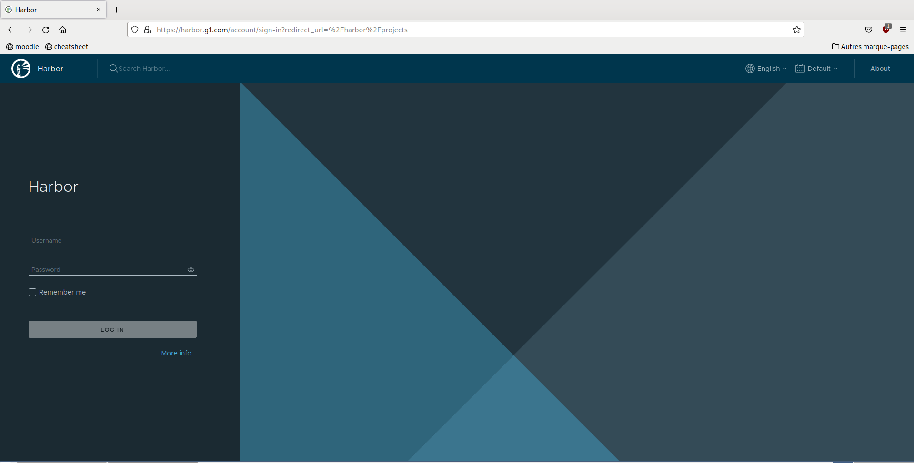
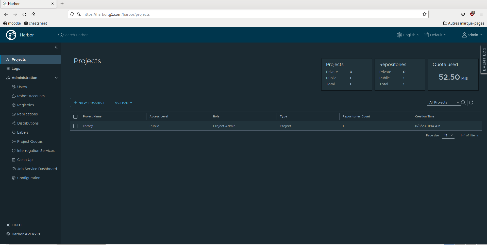
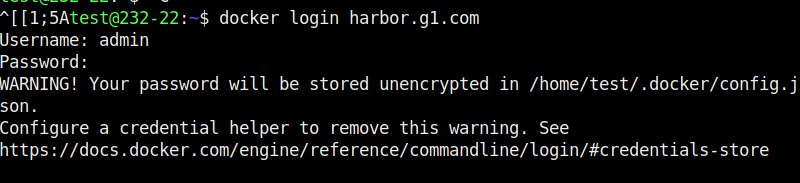
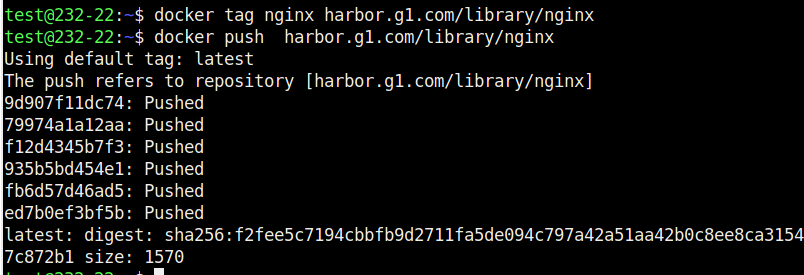
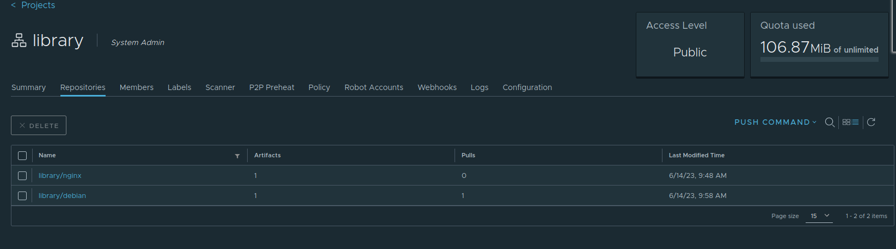
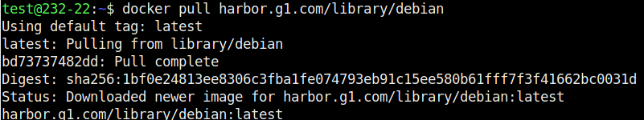

# Installation d'un serveur Harbor 
## Utilisation d'un registry pour gérer les images .


## Introduction

Nous avons decidé d'utiliser des VM fedoras de part leur petite taille et leur efficacité .
Je commence ainsi par crée ma VM fedora avec 4 CPU , 8GB de memoire et 160 GB d'espace de stockage qui sont les performances recommandé par le site officiel .


J'ai decidé de suivre la procédure officiel indiquer par Harbor au lien suivant , https://goharbor.io/docs/2.0.0/install-config/download-installer/

Ce qui me permet d'avoir une procédure stable et en plus sécurisé .

J'ai choisis la dernière version de Harbor disponible la V2.8.2 en passant par l'installateur offline qui prend plus de place mais permet d'avoir tous les fichier sur sa machine sans passer par le Docker HUB

## Installation 
Il est possible d'utiliser Harbor sans aucune sécurite en passant par un simple HTTP , or cela nous exposerais à différent type d'attaque comme le MAN in the middle .
Dans un environement de production l'on va toujours préferé le HTTPS , Pour l'utiliser nous avons besoin de crée des Certificats SSL .
Nous pouvons crée des Certificats qui son signé par des Trusted third-party CA ou alors signé nous meme nos certificats .
Ici nous allons utiliser OpenSSL pour crée des CA et grace à ces CA  signer notre Server Certificate 
et le Client Certificate .
Voici la procédure à suivre pour génerer ces clés https://goharbor.io/docs/2.0.0/install-config/configure-https/


Une fois nos differents certificats crée nous devons les donnée à docker et à Harbor . 


```
cp harbor.g1.com.cert /etc/docker/certs.d/harbor.g1.com/
cp harbor.g1.com.key /etc/docker/certs.d/harbor.g1.com/
cp ca.crt /etc/docker/certs.d/harbor.g1.com/
```

le ficher prepare permet d'activer le HTTPS , aprés avoir effectuer ./prepare on peut composer notre docker .


N'oublions pas d'activer le insecure-registries pour permettre d'accéder au site , il est important de noter que l'utilisation de registres non sécurisés présente des risques potentiels pour la sécurité, car les connexions ne sont pas cryptées. Par conséquent, il est recommandé de ne pas utiliser les "insecure registries" dans des environnements de production ou lorsque la sécurité des données est une préoccupation importante. 

Il faut crée le fichier etc/docker/daemon.json qui contiendra :
```
#ADD THIS FOR JOIN HARBOR SERVER

{
    "insecure-registries" : [ "harbor.g1.com:443", "192.168.16.122:443" ,"harbor.g1.com", "192.168.16.122" ]
}

```
Grâce à notre DNS nous pouvons directement accèder à l'harbor avec son nom symbolique .





Voici notre dépots images appelée library 



Pour pouvoir manipuler nos images il faut d'abord ce login depuis notre terminal ici on utilisera le compte admin .



Avant de pouvoir upload une image il faut d'abord la tag avec notre nom de domaine et notre library





rc="ia.png">



On peut aussi les pull avec un simple :
```
docker pull harbor.g1.com/library/nginx
```



